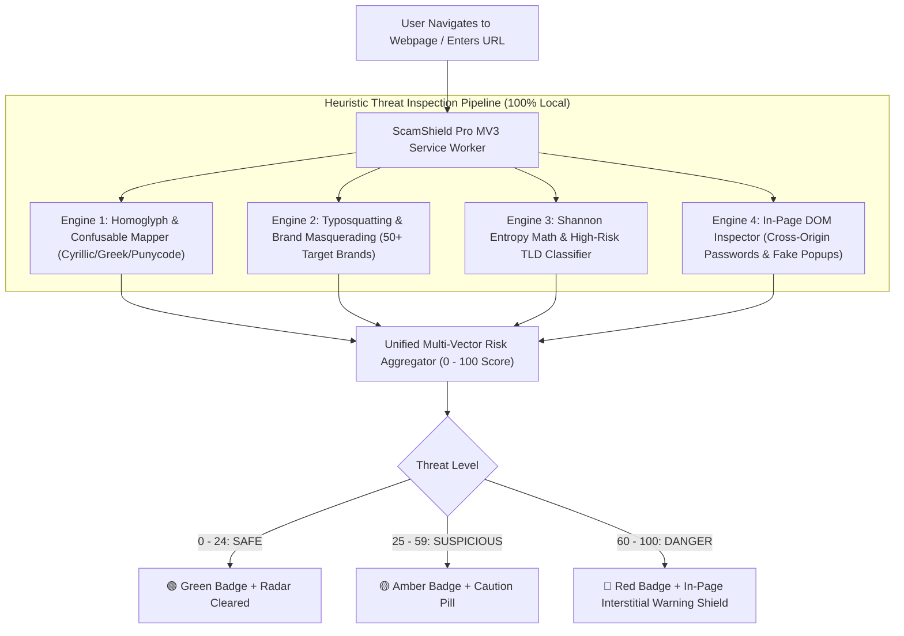

# 🛡️ ScamShield Pro — AI & Real-Time Phishing/Scam Detector

[](https://developer.chrome.com/docs/extensions/mv3/intro/)
[](#-privacy-guarantee)
[](#-automated-tests)
[](LICENSE)

**ScamShield Pro** is an enterprise-grade, privacy-first Manifest V3 browser extension for Google Chrome, Microsoft Edge, and Chromium browsers. It delivers real-time protection against online scams, phishing campaigns, Cyrillic/Greek homoglyph spoofing, brand typosquatting, high-risk disposable TLDs, and credential-harvesting DOM forms.

---

## ✨ Features & Architecture



---

## 🔍 Core Security Engines

### 1. Homoglyph & Unicode Confusable Engine (`src/engine/homoglyphs.js`)
* **IDN / Mixed-Script Attack Defense**: Spots visual lookalikes using Cyrillic (`а`, `е`, `о`, `р`, `с`, `у`, `х`, `і`, `ј`, `ѕ`) and Greek letters masquerading as Latin characters (e.g., `pаypal.com` with Cyrillic `а` `U+0430`).
* **RFC 3492 Punycode Handling**: Decodes `xn--...` encoded domains into normalized ASCII to uncover concealed phishing domains.
* **Zero-Width Character Stripper**: Detects and eliminates hidden unicode spaces (`U+200B`, `U+FEFF`, `U+00AD`) used to bypass naive keyword filters.

### 2. Damerau-Levenshtein Typosquatting Engine (`src/engine/typosquatting.js`)
* **Target Brand Database**: Monitored against top banking, crypto, tech, ecommerce, and telecom entities (Google, Microsoft, Apple, PayPal, Chase, Bank of America, Binance, Coinbase, MetaMask, Ledger, Netflix, Amazon, etc.).
* **Subdomain Masquerading**: Detects deceptive subdomains like `paypal.com.accounts-verify.xyz` where the authentic brand domain is placed into subdomains on a foreign root.
* **Combo-Squatting Detection**: Flags brand names concatenated with high-urgency keywords (`netflix-verify-billing.top`, `apple-security-login.com`).
* **Zero False Positives**: Built-in verification guarantees authentic official domains are whitelisted with zero false flags.

### 3. Domain Risk & Shannon Entropy Heuristics (`src/engine/domain-risk.js`)
* **Algorithmic Domain Detection (DGA)**: Calculates Shannon Entropy $H(X) = -\sum p(x)\log_2 p(x)$ on Second-Level Domains (SLD) to identify pseudo-random algorithmically generated phishing domains.
* **High-Risk TLD Risk Matrix**: Applies weighted scoring to high-velocity disposable TLDs (`.tk`, `.ml`, `.ga`, `.cf`, `.gq`, `.top`, `.xyz`, `.buzz`, `.icu`, `.sbs`, `.click`, `.rest`, `.cam`, etc.).
* **Structural Obfuscation**: Flags raw IP hostnames (`http://192.168.1.100`), unencrypted HTTP credential channels, open redirect query strings, and `@` userinfo authority spoofing.

### 4. In-Page DOM Threat Inspector (`src/content/dom-scanner.js`)
* **Cross-Origin Password Harvesting**: Automatically intercepts HTML `<form>` elements containing password inputs that submit credentials to third-party unauthorized origins.
* **Deceptive Anchor Mismatch**: Detects anchor tags (`<a>`) where the visible link text displays a trusted institution (e.g. `https://chase.com`) but the `href` directs users to a malicious host.
* **Tech Support & Scareware Phrasing**: Scans for panic-inducing phrases ("Windows Defender Alert", "Call Microsoft Support immediately", "Seed phrase export").
* **In-Page Interstitial Warning Shield**: Displays an immediate warning modal on high-risk pages with a one-click "Return to Safety" escape hatch.

### 5. Cyber Defense Radar & Instant Inspector UI (`src/popup/` & `src/options/`)
* **SVG Circular Radar Meter**: Displays animated real-time risk scores with color-changing gauge strokes (Green/Amber/Red).
* **Instant Link Inspector**: Allows users to paste any suspicious link received via SMS, email, or chat to evaluate safety before visiting.
* **Threat Intelligence Hub**: Full options page featuring threat audit history logs, JSON export, custom whitelist/blacklist management, and custom brand monitors.

---

## 📁 Repository File Structure

```
scam-shield-extension/
├── manifest.json                     # Chrome/Edge MV3 Declaration & Permissions
├── README.md                         # Full Project & Architecture Documentation
├── test-demo.html                    # Interactive Live Attack Vector Test Lab
├── .gitignore                        # Git ignore file
├── icons/                            # Extension PNG Assets
│   ├── icon16.png                    # 16x16 toolbar icon
│   ├── icon48.png                    # 48x48 extension manager icon
│   └── icon128.png                   # 128x128 high-res store icon
├── src/
│   ├── engine/                       # Modular Threat Detection Core
│   │   ├── brands.js                 # 50+ Brand Registry & Sensitive Action Keywords
│   │   ├── homoglyphs.js             # Unicode Confusables, Punycode & Lookalikes
│   │   ├── typosquatting.js          # Damerau-Levenshtein & Subdomain Spoofing
│   │   ├── domain-risk.js            # Shannon Entropy (DGA) & TLD Heuristics
│   │   └── risk-aggregator.js        # Multi-Vector Risk Weighted Scoring Engine
│   ├── background/
│   │   └── service-worker.js         # Tab lifecycle listener & dynamic badge manager
│   ├── content/
│   │   ├── dom-scanner.js            # In-page DOM inspector & credential protector
│   │   └── shield-overlay.css        # In-page warning shield modal stylesheet
│   ├── popup/
│   │   ├── popup.html                # Cyber Radar Dashboard & Link Inspector UI
│   │   ├── popup.js                  # Gauge animator & popup controller
│   │   └── popup.css                 # Dark cyber theme styling
│   └── options/
│       ├── options.html              # Threat Intelligence Hub & Settings Page
│       ├── options.js                # Threat audit logs, JSON exporter, whitelist/blacklist
│       └── options.css               # Options dashboard styling
└── tests/
    ├── engine.test.js                # 29 Automated Heuristic Unit & Integration Tests
    └── generate-icons.js             # Standalone PNG binary icon generator
```

---

## 🚀 Installation Guide

### Loading in Google Chrome / Microsoft Edge / Brave:

1. Clone or download this repository:
   ```bash
   git clone https://github.com/SoulaymaneBoulaich/SacmShieldDetector.git
   ```
2. Open your browser and navigate to the Extensions page:
   * **Chrome**: `chrome://extensions/`
   * **Edge**: `edge://extensions/`
   * **Brave**: `brave://extensions/`
3. Enable **Developer Mode** using the toggle switch in the top-right corner.
4. Click the **"Load unpacked"** button in the top-left corner.
5. Select the project root directory (`SacmShieldDetector` or `scam-shield-extension`).
6. Pin **ScamShield Pro** (🛡️) to your toolbar!

---

## 🧪 Testing ScamShield Pro

### 1. Run Automated Unit Tests (CLI)

```bash
node tests/engine.test.js
```

**Test Output:**
```text
====================================================
  ScamShield Pro - Heuristic Engine Test Suite
====================================================

[1] Testing Homoglyph & Unicode Confusable Engine...
  ✓ Flagged Cyrillic homoglyph in 'pаypal.com' (Score: 65)
  ✓ Generated homoglyph detection flag
  ✓ Correctly decoded homoglyph to ASCII 'paypal.com' (Got: 'paypal.com')
  ✓ Detected Punycode IDN encoding
  ✓ Clean ASCII domain gets 0 homoglyph risk score

[2] Testing Typosquatting & Brand Spoofing Engine...
  ✓ Transposition distance is 1
  ✓ Substitution distance is 1
  ✓ Deletion distance is 1
  ✓ Flagged typosquat 'goolge.com' (Score: 85)
  ✓ Identified target brand as Google (Got: Google)
  ✓ Flagged subdomain masquerade (Score: 90)
  ✓ Generated SUBDOMAIN_BRAND_MASQUERADE flag
  ✓ Flagged combo-squat 'apple-login-verify.com' (Score: 85)
  ✓ Legitimate official domain recognized as official (0 false positive)
  ✓ Legitimate official domain gets 0 risk score

[3] Testing Domain Risk & Shannon Entropy Heuristics...
  ✓ Flagged high-risk TLD .tk (Score: 45)
  ✓ Generated high-risk TLD flag
  ✓ Detected IP address as hostname
  ✓ Detected unencrypted HTTP
  ✓ Detected dangerous redirect parameter
  ✓ Detected Userinfo @ authority spoofing
  ✓ DGA entropy (3.42) > Normal entropy (2.25)

[4] Testing Unified Risk Aggregator Pipeline...
  ✓ Correctly verdicted 'https://pаypal-verify-account.tk/login' as DANGER (Got: DANGER, Score: 100)
  ✓ High risk score for complex phishing vector (100)
  ✓ Legitimate URL verified as SAFE (Got: SAFE)
  ✓ Whitelisted URL gets 0 risk score
  ✓ Detected combo typosquat + DOM harvesting as DANGER (Score: 100)
  ✓ Identified target brand as Binance (Got: Binance)
  ✓ Custom whitelist overrides TLD risk

====================================================
  Tests Passed: 29 | Tests Failed: 0
====================================================
  ALL SCAM DETECTOR HEURISTIC TESTS PASSED CLEANLY!
```

### 2. Live Browser Test Vectors

Open `test-demo.html` directly in your browser or paste these URLs into the **Link Inspector** in the popup:

| Test URL | Attack Category | Expected Verdict |
| :--- | :--- | :--- |
| `https://pаypal-verify-account.tk/login` | Cyrillic Homoglyph + High-Risk TLD | **100% DANGER** (PayPal) |
| `https://goolge.com/signin` | Typosquatting (Levenshtein Distance = 1) | **85% DANGER** (Google) |
| `https://netflix.com.verify-billing.xyz` | Subdomain Brand Masquerade | **90% DANGER** (Netflix) |
| `https://binance-claim-airdrop.top` | Crypto Scam Keyword Combo + `.top` TLD | **85% DANGER** (Binance) |
| `http://192.168.1.100/login` | Raw IP Hostname + HTTP | **75% DANGER** |
| `https://github.com/trending` | Official Whitelisted Domain | **0% SAFE** |

---

## 🔒 Privacy Guarantee

* **100% Client-Side Evaluation**: All heuristic calculations, domain parsing, and DOM checks run locally inside the browser.
* **Zero Telemetry**: No browsing history, visited URLs, or private user data are ever sent to external cloud servers.

---

## 📄 License

MIT License. Feel free to use, modify, and distribute for security and educational purposes.